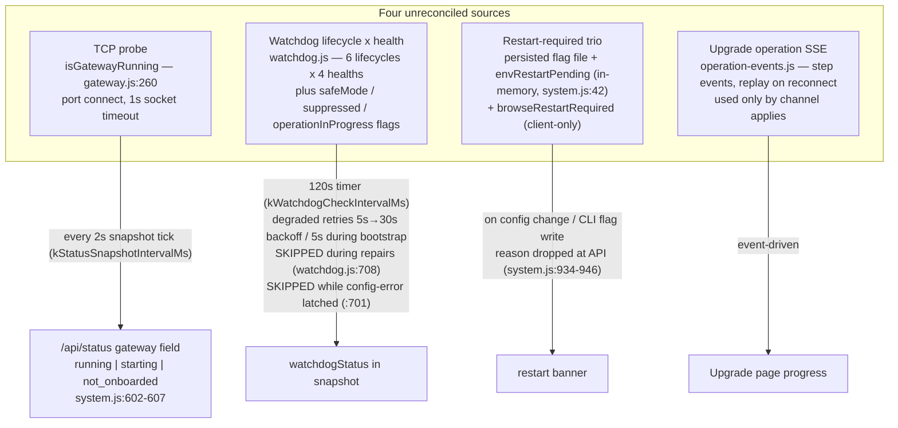
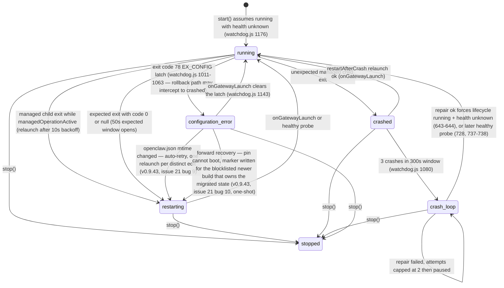
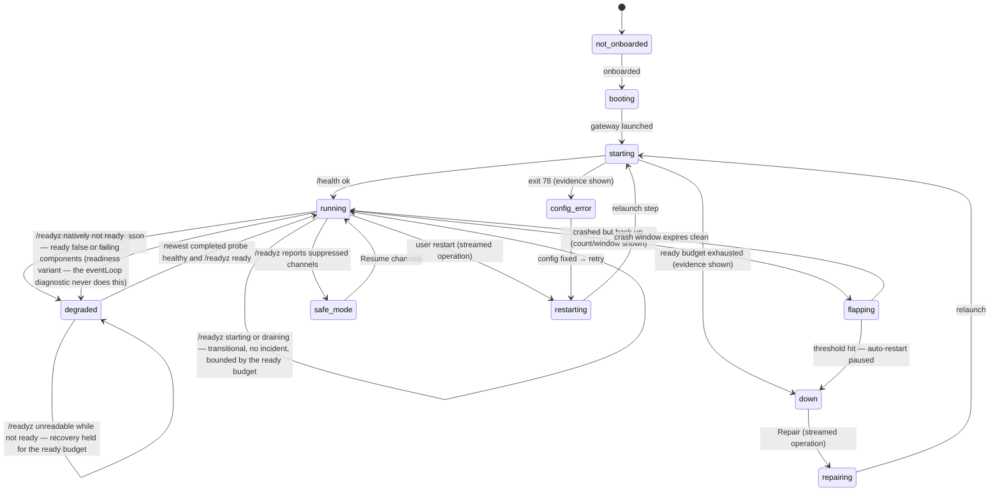
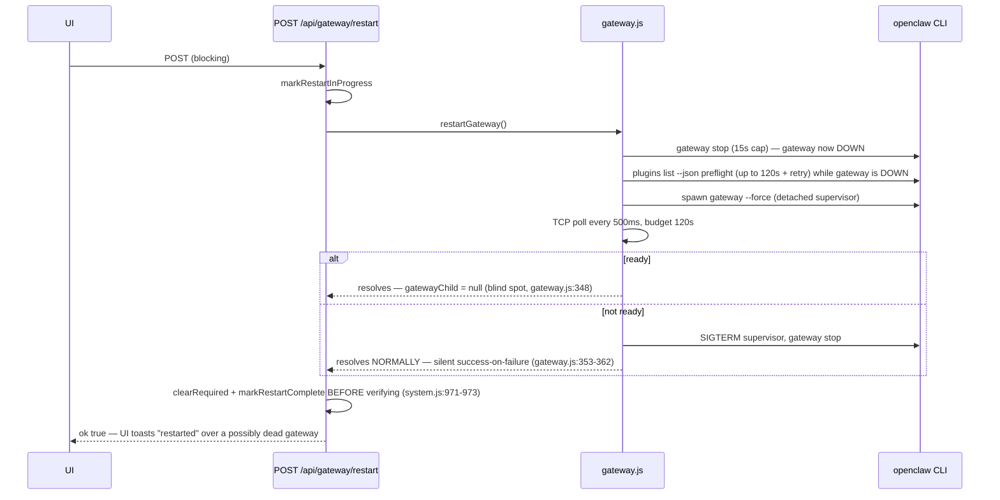
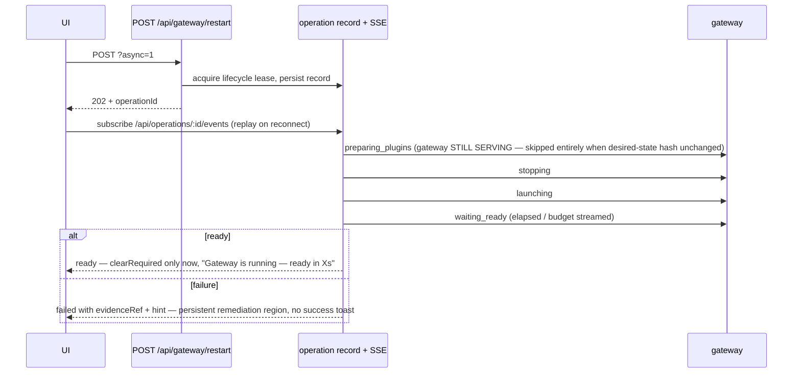

# Gateway State Model

> **Status (2026-08-29):** M2/M3 shipped in v0.9.37. The normative sections
> (§3–§10) describe what now runs; §2's "as-implemented, pre-M2" survey is
> historical. Known deviation from the §5 repair-lock matrix: manual repairs
> currently skip with HTTP 200 `{skipped:true}` instead of queueing — tracked
> in TODOS.md ("Manual repair should queue on the lifecycle lock, not skip").
> The plan file referenced below was a working artifact and does not ship in
> this repo.
>
> **2026-09-07 (issue #76, v0.9.77):** §4 row 5's "repair attempts exhausted"
> is now reachable (`runRepair` books `repair/<source>/skipped
> {repair_attempts_exhausted}`; TODOS F015) and the row gained the scoped
> auto-repair pause; §9's Repair contract carries the crash-cause classifier,
> the structural ladder, `reconcileInstalled` and the launch-compatibility
> gate. Known deviation from the #76 plan text: the second hold key it named
> (`versionMismatchHold`) was NOT built — one reason-aware `state.gatewayHold`
> (`kStructuralHoldReasons` vs migration-class reasons) replaced it, so every
> launch path that honoured `gatewayHold` honours the new holds for free. The
> manual-repair deviation above stands.

Canonical reference for the AlphaClaw gateway state model: the as-implemented state sources (pre-M2), the target unified model (M2), and the restart pipeline (M3). Implementers of M2.2–M3.x and reviewers of those PRs read this file; the plan (`system-instruction-you-are-working-modular-turing.md`) is the approved source — where current code disagrees with the plan, the plan wins and the code is marked "current code:".

**Reading guide.** §2 is descriptive (what exists today, with file:line refs). §3–§10 are normative (what M2/M3 build). The State × UI matrix (§5) is the single source for UI labels, popovers, and notification copy. The precedence table (§4) is the reducer's contract; the reducer test matrix (M2.2) is generated from it.

> **2026-09 update (post-incident hardening, supersedes the 120s figures below).**
> The restart ready budget is no longer a fixed 120s: it is env-tunable
> (`GATEWAY_RESTART_READY_TIMEOUT`, default 300s, clamped 30–480s,
> `constants.js`), and every restart-class lifecycle-lock hold, the operation
> record's lifetime (with a queue/step keepalive refresh), and the watchdog
> expected-restart suppression windows derive from one shared
> `kGatewayRestartOperationBudgetMs`. A restart that fails now persists a
> redacted evidence tail + cause-line-enriched `errorSummary` on the
> operation record (0600 `alphaclaw-restart-operation.json`), aborts the wait
> early when the restart supervisor dies (with one final readiness probe),
> and a lock-contention failure ("another OpenClaw process owns
> state-lifecycle") appends the live openclaw processes to the evidence —
> upstream's coordinator is an exclusive SQLite transaction held by a live
> process, never a stale file (`openclaw-lock-contention.js`, read-only).
> The pre-M2 defect list below is retained as history.

---

## 2. Current state (as-implemented, pre-M2)

Four status sources exist. None reconciles with the others; each is "correct" per its own machine.



Known contradictions this produces (the screenshot bug): TCP says `running` (green, refreshed every 2s) while the watchdog says `crash_loop` (red, waiting for a 120s timer tick that is skipped while `operationInProgress`). Dead-but-onboarded reads as `starting` forever (`system.js:602-607` has no `down`).

### Watchdog machine as implemented

Lifecycle axis (`stopped | running | restarting | crashed | crash_loop | configuration_error`) and health axis (`unknown | healthy | degraded | unhealthy`) mutate together but are stored separately.



Current code (v0.9.39): the exit-78 branch consults the **gateway startup medic** (`gateway-medic.js`, default on via `updates.openclaw.medic.enabled`) after the rollback-eligibility check and before the incident settles. The watchdog enters `configuration_error`, then runs the medic under the gateway lifecycle lock (at most 2 attempts per incident, 5 runs per rolling hour across incidents); a successful repair transitions `configuration_error → restarting` and relaunches, and only when the medic is disabled, rate-limited, lock-contended, or out of remedies does the restart-paused latch notification fire. The diagram above predates the medic and shows only the direct latch path.

Current code (v0.9.43, issue #21): two more ways out of `configuration_error`. (1) **Auto-retry on config change** — every latch site records openclaw.json's mtime (`latchConfigError`); the latched health tick no longer bails blind but watches for a distinct new mtime (operator edit, medic fix, boot restore) and re-arms exactly one relaunch per edit (`maybeRetryAfterConfigChange`); another exit 78 re-latches with the new baseline, so it can never loop. A reconciler gateway hold (`state.gatewayHold`, issue #20) outranks the auto-retry: while held, config edits route through the reconcile-retry flow (which validates before launching) instead of a blind relaunch. (2) **Forward recovery** — when the PIN itself exits 78 (rollback-ineligible) and a NEWER blocklisted build with a local overlay exists whose blocklist reason implies it owns the migrated state (`config_error`/`config_migration_failed`), the ladder's last resort before the latch asks the channel layer to move FORWARD to it (`requestForwardRecovery`, one-shot via the persisted `forwardRecovery.attemptedId`; a second pin failure sets `noBootableVersion` and latches for good). The gateway card in `config_error` also surfaces the Repair action directly. Kill switches: `OPENCLAW_MIGRATION_GATE=off`, `OPENCLAW_FORWARD_RECOVERY=off`.

Health axis setters:

| health | set by |
|---|---|
| `unknown` | every launch/restart transition; repair success before verify |
| `healthy` | successful `/health` probe (`watchdog.js:737`) — also forces `lifecycle=running`, clears crash window |
| `degraded` | failed probe past 30s startup grace and 3-strike startup threshold (`watchdog.js:857`); starts the degraded retry loop (5s → 10s → 20s → 30s cap; counter survives green-`/health`-but-failing-`/readyz` ticks) |
| `unhealthy` | crash/config-error exits; failed repair |

Defects to carry into M2 (all current code):

- **`onExpectedRestart()` is dead code** (`watchdog.js:1155-1165`). Nothing calls it; manual restarts never open the expected-restart suppression window, so probes during a restart read as real failures.
- **15s expected window vs 120s ready budget.** `kExpectedRestartWindowMs = 15s` (`watchdog.js:13`) but `waitForGatewayReady` budgets 120s (`gateway.js:43`). Even where the window *is* opened (expected exit path), it expires 8× before the restart budget, producing false `degraded` mid-restart — which can trip the channel-rollback hook (`watchdog.js:870-897`, 10-min degraded rollback).
- **Detached-supervision blind spot.** `runGatewayRestartCmd` discards the child on success (`gatewayChild = null`, `gateway.js:348`). After the first manual restart the watchdog owns no process: no exit events, so `crashed`/`crash_loop`/`configuration_error` transitions are unreachable until the next managed launch; `gatewayPid` is lost and uptime goes stale. *Closed in v0.9.70:* the ready branch now adopts a still-alive supervisor as the managed child — see the §9 update.
- **Probe skips.** `runHealthCheck` returns immediately while the config-error latch is set (`watchdog.js:701`) and while `operationInProgress` unless explicitly allowed (`:708`) — the exact moments the UI most needs fresh truth.

---

## 3. Target model — orthogonal axes, derived headline

Four independent axes; the headline is a pure derivation, never stored as opinion:

| axis | values | fed by |
|---|---|---|
| availability | `up` / `degraded` / `down` | shared TCP probe + `/health` probe results, each with `observedAt` |
| operation-in-flight | `none` / `restarting` / `repairing` / `applying` | gateway-lifecycle mutex lease + operation record |
| supervision | `managed` / `adopted` / `detached` | whether AlphaClaw owns a live child process (`managed`), discovered the serving identity of a gateway it did not launch (`adopted`, v0.9.75 — the watchdog's `supervisionMode`, §9), or neither (`detached`) |
| restart-required | `reasons[]` (coded) | unified restart-required store |

`GatewayState` enum (the derived headline): `not_onboarded | booting | starting | running | degraded | flapping | safe_mode | config_error | down | unknown`. Operations render as a badge/progress card alongside the headline, not as a fifth availability value. Restart-required renders as a banner, never a headline.



---

## 4. Deterministic precedence table

The reducer evaluates rows in order; the first true predicate wins. Every input carries `observedAt`. Constants reference `constants.js` names (M2 adds the `kState*` ones).

| # | state | predicate (all prior rows false) |
|---|---|---|
| 1 | `not_onboarded` | onboarding marker absent (`isOnboarded()` false, `gateway.js:209`). Local file read — never stale. |
| 2 | `booting` | `bootPhase !== "ready"` — the boot sequence holds the lifecycle mutex. `bootPhase === "failed"` → `booting(failed)` variant with the captured boot error as reason. |
| 3 | `unknown` (stale) | newest `observedAt` across {tcp, health, operation} older than `kGatewayStateStaleMs` (15s), or the snapshot compute error counter indicates consecutive failures. Independently, the UI marks a snapshot last-known when `snapshotStale` is true or its observation ages past 15s: a gray indicator, “Last known —” before the state label, “Status updates unavailable.” and an observation-age stamp. There is no additional 30s freshness grace. |
| 4 | `config_error` | config-error latch set: last observed gateway exit code == 78 (`kOpenclawConfigErrorExitCode`) and not since cleared by a successful launch or config-fix retry. Current code (v0.9.39): the startup medic (default on) runs first under the lifecycle lock and may clear the latch itself by repairing openclaw.json and relaunching (`runConfigMedic`, watchdog.js); `config_error` settles only after the medic is disabled, rate-limited, or exhausted (2 attempts/incident). Detached mode: latch only from evidence (stderr tail), labeled estimated. |
| 5 | `down` | `tcp.up === false` AND no active operation lease AND no relaunch pending — i.e. auto-restart paused (crash-loop threshold hit: `crashCountInWindow >= kWatchdogCrashLoopThreshold` (3)), repair attempts exhausted (`>= kWatchdogMaxRepairAttempts` (2) — **enforced from v0.9.77 (TODOS F015): `runRepair` books `repair/<source>/skipped {reason: "repair_attempts_exhausted"}` for automatic sources past the cap while `restartAfterCrash`'s backoff relaunches continue; the counter resets only on a verified replacement**), the **scoped auto-repair pause** (`watchdog.autoRepairPaused`, #76 B1.3 — a corroborated version-family crash whose structural repair failed, or a relaunched child that died inside its launch window twice with the same fingerprint; nothing relaunches until an operator resumes it, the installed build changes or the gateway passes the acceptance hold), or the last launch terminal-failed its ready budget. Reason carries last evidence + since; the pause and the exhausted budget each have their own reason copy (`kAutoRepairPauseCopy` / `kRepairAttemptsExhaustedCopy`, `gateway-state.js`). |
| 6 | operation-in-flight (badge) | active lifecycle-mutex lease with a live operation record. Headline while the lease is held: `starting` when the current step is `launching`/`waiting_ready` and elapsed < ready budget; otherwise the operation kind labels the badge (`restarting` / `repairing` / `applying`) over the last settled headline. Transient `tcp.down` during a leased operation is expected and does **not** fall to row 5. |
| 7 | `flapping` | `tcp.up === true` AND `1 <= crashCountInWindow < kWatchdogCrashLoopThreshold` (3) within `kWatchdogCrashLoopWindowMs` (300s). At the threshold auto-restart pauses and row 5 takes over. Detached mode: crash count is probe-inferred (§9) and labeled estimated. |
| 8 | `degraded` | `tcp.up === true` AND (last `/health` probe failed or reported not-ok, OR `/health` green while `/readyz` NATIVELY reports not ready — `ready: false` or failing components — the `degraded (readiness)` variant, §5; **#87:** the body's `eventLoop` diagnostic is telemetry (`event_loop_pressure` rows, `eventLoopDegraded`) and never takes this row, a `starting` / `draining` body is transitional and stays row 10 inside the ready budget (`kGatewayRestartReadyTimeoutMs`), and a transport error on `/readyz` while this generation's last consumed `/readyz` said not ready (the open `readinessDegradedKey` episode, or the transitional clock `readinessTransitionalSinceMs` — both survive a liveness flap) HOLDS this row instead of assuming recovery, bounded by the same budget (a transitional hold keeps health healthy and the 5 s cadence instead); a verdict is written only by the newest COMPLETED probe). **Gate (v0.9.75):** while `health === "unknown"` (startup) the 3-strike `kWatchdogStartupFailureThreshold` applies past the 30s `kHealthStartupGraceMs` grace; in steady state the FIRST failed probe sets `degraded` and starts the 5s→30s degraded-retry ladder, and auto-repair (`doctor --fix` → verified replacement) fires only after `kWatchdogDegradedRepairThreshold` (default 3, `WATCHDOG_DEGRADED_REPAIR_THRESHOLD`, clamped 1–20, deployment env only) CONSECUTIVE liveness failures — the ladder's own `degraded_retry` ticks may escalate, so a sustained outage reaches repair ~15s after the first miss, while one transient timeout books `repair/<source>/skipped {reason: "awaiting_sustained_failure"}` and nothing else. Readiness-only degradation never counts toward repair (upstream's `/readyz` is advisory; escalation policy is a TODOS item). A proven-dead serving pid (`pidAlive` false or `/proc` start ticks changed) skips Doctor entirely and relaunches under the crash-restart discipline (`crash/probe_death`). Reason = probe error (or `readinessReason`) + `observedAt`. |
| 9 | `safe_mode` | `tcp.up === true` AND health ok AND `/readyz` reports suppressed channels. Reason = suppressed channel names. |
| 10 | `running` | `tcp.up === true` AND health ∈ {healthy, unknown-within-startup-grace} AND none of the above. |

Binding rules: at most one primary action per state (§6); `restart-required.reasons[]` renders as banner regardless of headline; the headline never renders a raw enum name (§5 labels only). **Restart always offered (v0.9.73):** every onboarded state except `booting` carries a restart-class action (Restart or Retry). Repair, Resume channels and Refresh are the *recommended* move in their states, never the *only* one — a repair-only Unstable card had left operators with no way to relaunch the gateway from the admin UI without running doctor first. `booting` is exempt because boot IS the launch. "Offered" is not "always runnable": the action is disabled with a `disabledReason` while another leased operation holds the lifecycle lock (precedence 1), while a watchdog-owned relaunch is in flight (2), while the release-channel state is unreadable/corrupted (3, fail-closed), or while a reconciler gateway hold is set after a failed settings migration (4; Repair is blocked too, since `doctor --fix` would rewrite the held config). The route refuses with an actionable 409 (`booting` while boot holds the lock, `apply_in_progress`, `gateway_hold_unreadable`, `gateway_held`); every refusal carries a `hint`, and the copy lives in one place (`kGatewayHoldCopy`, `gateway-state.js`). `POST /api/gateway/restart` queues on the lock (§7) and **re-validates both blockers once it holds it** — a hold set while the restart was queued fails the operation (terminal event with `code: gateway_held`, ledger entry `skipped`, never a "failed restart"), and a queued acquire surfaces a `waiting_for_lock` step via the lock's own `onQueued` callback so a wait is never silent.

---

## 5. State × UI matrix

**This table is the single source for UI labels, glossary popovers, AND notification copy.** Notifications draw from the same public-label map — no raw `crash_loop` in alerts.

| enum | UI label | dot | reason copy template | actions (primary first) |
|---|---|---|---|---|
| (no data yet) | "Connecting to AlphaClaw…" | gray | client-owned, only pre-first-frame | none; Restart disabled |
| not_onboarded | Not set up yet | gray | — | Set up |
| booting | AlphaClaw starting | cyan pulse | current phase | — (deliberate: boot IS the launch; a restart queued behind the boot hold would recycle a gateway that just came up — `boot_failed` carries Retry) |
| booting(failed) | Startup failed | red | error summary | **Retry** · View logs |
| starting | Starting | cyan pulse | "usually under 30s (0:34 / 2:00 max)"; past typical: "taking longer than usual" — no fake progress | View logs · Restart (disabled with reason under a leased operation AND while a watchdog relaunch is in flight — `lifecycle` restarting, `crashed` with an active backoff, or `operationInProgress`, since crash relaunches release the lock at spawn and the exit-78 auto-retry never takes it; the relaunch guard applies only to this TCP-down state; enabled once the launch is only waiting on its first health check) |
| running | Running | green steady | "up 3h 12m" | Restart |
| degraded | Running with issues | yellow steady | last probe error + observedAt | View logs · Restart |
| degraded (readiness) | Running with issues | yellow steady | "The port answers and /health is green, but readiness checks are failing (<components>)." — `readiness: "not_ready"`, `readinessReason` = failing component names (or `ready:false`, or `"<status> did not complete within Ns"` once a transitional phase outlived the ready budget), `degradedReason: "readiness_failing"`; one verbose "🟡 Gateway is up but not ready — <components>" notice per incident (`gateway_readiness` incident when none is open); no recovery notice, no incident close, no `onHealthy` acceptance credit until `/readyz` is green again. **#87:** only OpenClaw's NATIVE verdict (`ready: false` / failing components) takes this row — `eventLoop.degraded` never does; `readinessProbe: "ok"` and `readinessStatus` say how the last `/readyz` read went and what the body said; while a later `/readyz` cannot be read (`readinessProbe: unavailable \| timeout \| malformed`) the row is HELD — no recovery, deduped `health_check/ok {readinessPending, readinessProbe}` rows, the retry ladder keeps probing — until the ready budget fails it open (`readiness_probe_error {recoveryAssumed: true}`); the detached Doctor's structured finding, when one exists, rides as ONE `readiness_advisory` row ("doctor: <checkId> (<severity>)"), evidence never trigger. The Watchdog tab's gateway-health card keys on this verdict (`classifyReadinessCard`, #87 G5): DEGRADED only for `readiness: not_ready` (component rows, or one generic signal from `readinessReason`) or a legacy status without the field; `ready` / `unknown` render a retained `readyzFailing[]` as a neutral "Reported by /readyz (telemetry)" list ("OpenClaw reports it ready" / "readiness unverified (<probe>)"); the transitional row below renders no readiness card. A dedicated `alive_not_ready` phase/label is a TODOS follow-up | View logs · Restart |
| running (transitional readiness, #87) | Running | green steady | "Up — channels still starting." / "Up — draining." — `/readyz` consumed a `starting` / `draining` body inside the ready budget: `readiness: "not_ready"`, `readinessStatus: starting \| draining`, `readinessReason` = the status; NOT an incident, NOT degraded (no `degradedReason`, no notice, no `onUnhealthy`/`onHealthy`, no acceptance credit, a pending replacement is not certified); deduped `health_check/ok {readinessPending, readinessStatus}` rows ("up, still starting" / "up, draining"); a 5 s cadence keeps probing (the bootstrap loop's tick, or outside it one single-shot `readiness_recheck` probe re-armed by every transitional observation). Past `kGatewayRestartReadyTimeoutMs` (`readinessTransitionalExpired`) the same observation becomes the `degraded (readiness)` row above. The clock is generation-local: a liveness flap resets the axis (`readiness: unknown`) but never restarts the budget, and a `/readyz` transport error right after the flap still holds with this row's flavour (#87 F1). An explicit `ready: true` beside a `starting` / `draining` status is NOT this row — it is ready, the status is telemetry (#87 F5) | Restart |
| flapping | Unstable | red steady | "3 restarts detected in 5 min — up 40s" (+detail: "estimated — gateway runs outside AlphaClaw's supervision" when probe-inferred) | **Repair** · Restart · View logs · Roll back (confirm via `confirm-dialog.js`; only in stabilization window) |
| safe_mode | Channels paused | yellow steady | suppressed channel names | **Resume channels** · Restart |
| config_error | Configuration error | red steady | first redacted stderr lines | **View config error** · Retry · View logs |
| down | Down | red steady | reason + last evidence + since | **Retry** · Repair · View logs |
| unknown | Status unavailable | gray hollow | current state cannot be confirmed | Refresh · Restart · View logs |
| stale snapshot or observation older than 15s | Last known — (last state label) | gray | “Status updates unavailable.” plus “as of” observation stamp; elapsed state time freezes at that observation | unchanged, Restart disabled |

### Dot / motion

| treatment | rule |
|---|---|
| pulse | **operation in progress only**: booting, starting, restarting, repairing |
| green steady | running — a healthy system doesn't animate |
| steady (yellow/red) | all settled states: degraded, flapping, safe_mode, config_error, down |
| gray | unavailable (`unknown`) or last-known evidence from a stale snapshot |

One shared status-icon treatment (icon + text + color); error states carry an icon, never color alone. One global `prefers-reduced-motion` block covers all pulse keyframes.

### Glossary source table (one-liners for popovers + notifications)

| state | meaning (one line) | typical fix |
|---|---|---|
| Not set up yet | AlphaClaw hasn't completed onboarding | Run Set up |
| AlphaClaw starting | The AlphaClaw server itself is still booting | Wait; Retry if it fails |
| Starting | The gateway was launched and hasn't answered a health check yet | Wait up to 2 min; View logs; Restart if it stalls |
| Running | Port open and last health check passed | — |
| Running with issues | Port open but the health check is failing — or `/health` is green while `/readyz` reports failing components ("up but not ready") | View logs; Restart if it persists (repair auto-fires only after 3 consecutive liveness failures; readiness alone never triggers it) |
| Unstable | The gateway keeps crashing and being brought back | Repair; Restart relaunches without diagnosis; Roll back if a recent upgrade caused it |
| Channels paused | Gateway healthy but some channels are suppressed (safe mode) | Resume channels (Restart relaunches but does not resume them — OpenClaw's crash-loop breaker re-applies the suppression at startup) |
| Configuration error | The gateway refused to start because its config is invalid (exit 78) | View config error, fix the file, Retry |
| Down | The gateway is not running and automatic recovery has stopped | Retry; Repair |
| Status unavailable | AlphaClaw can't currently confirm gateway state | Refresh; check that AlphaClaw itself is reachable; Restart is still available |

---

## 6. `actions[]` API contract

Each status frame's `state.actions[]` entry:

```
{ id, label, kind: "primary" | "secondary" | "danger", needsConfirm?, disabledReason?, description? }
```

- **At most one `kind:"primary"` per state**, bound in §4/§5 (bold entries); `booting` and `starting` have none.
- **Every onboarded state except `booting` carries a restart-class action** (`restart` or `retry`) — see the "Restart always offered" rule under §4. `disabledReason` copy lives in `kLifecycleActionBlockReasons` (`gateway-state.js`): operation-in-progress outranks gateway-held.
- `description` = "what this does + expected duration"; rendered as the tooltip and as the confirm-dialog body when `needsConfirm` is set.
- `disabledReason` renders the action disabled with a tooltip (e.g. Restart while an operation badge shows).
- **The client renders, never derives.** The client-side label derivation in `components/gateway.js:31-68` is deleted in M2.2; the sole exception is the version-skew adapter rendering the legacy presentation when `state` is absent (old server).

---

## 7. Attach-vs-409 matrix — gateway lifecycle lock

One mutex serializes every gateway-mutating path. Lease deadline = operation-record expiry, force-released at `kGatewayLifecycleLeaseMs` (10 min, `constants.js`; restart-class holds pass their own `leaseMs` from the shared `kGatewayRestartOperationBudgetMs`; the repair hold is leased at the Doctor ceiling PLUS the restart budget so a 10-minute `doctor --fix` followed by a cold restart never outlives it). Force-release is an **ownership query, not a process-tree kill**: the `release` function returned by `acquire()`/`tryAcquire()` carries `holdId`, `isValid()` (still the owner), `isExpired()` (the lease timer fired), `kind` and `startedAt`; a holder re-checks `isValid()` after every `await` and before every spawn (`requestGatewayLaunch({ shouldAbort })`, `runGatewayColdStart({ shouldAbort })`) and, once expired, books `skipped {reason: "lease_expired"}` without touching lifecycle — the work already underway is not cancelled (AbortSignal into the Doctor runner is the recorded TODOS item). Stale locks recovered at boot (records closed as "interrupted restart"). No cancellation or priorities in v1 — one operation at a time.

| requester | when idle | when another op active |
|---|---|---|
| User restart button | acquire-queue (new restart op) | active restart → **attach-to-existing** (return existing operationId); active repair/boot → **attach** (their relaunch is the outcome the user wants); active apply/rollback → **409-with-operationId** (mirrors `system.js` apply latch) |
| User repair button | acquire-queue | active repair → **attach**; active restart/boot → **acquire-queue** (repair does more than relaunch — runs after); active apply/rollback → **409-with-operationId** |
| Channel apply's restart step | runs under the apply's own lease (acquire-queue at apply start) | active restart/repair → **attach-to-existing** relaunch; conflicting apply → **409-with-operationId** |
| WhatsApp login restart | acquire-queue | active restart/repair/boot → **attach-to-existing**; active apply/rollback → **409-with-operationId** |
| Watchdog auto-restart timer | try-acquire (succeeds) | **try-acquire-skip** — logs an "operation in progress" watchdog event; a background loop never parks on a lock |
| Watchdog auto-repair timer | try-acquire (succeeds) | **try-acquire-skip** (logged) |
| Boot sequence | acquires and **holds the lock for the whole boot** (no boot-vs-API races) | n/a — boot runs first; it reconciles/closes any stale lease from a previous process |
| Rollback (channel hooks) | acquire-queue | active apply → **attach** (rollback is the apply's own failure path, same lease); active restart/repair → **acquire-queue** (runs after; supersedes further auto-restarts); conflicting rollback → **attach-to-existing** |

Conflict UX: Restart proactively disabled with `disabledReason` while any operation badge shows; a late 409 toasts "Another operation is running — attached to its progress" and attaches to the returned operationId's stream.

---

## 8. Restart sequence — current vs target

### Current (as-implemented)

Current code: `POST /api/gateway/restart` (`system.js:964-980`) → `restartGateway` → `runGatewayColdStart` (`gateway.js:364-368`). Pre-M1 every step was `execSync` (event loop frozen up to ~270s); M1.4 made them async but the ordering and silent-failure semantics are unchanged.



### Target (M3)

Prepare-first ordering (M3.1) + streamed operation (M3.2) + honest outcomes (M3.3). HTTP compat: blocking semantics remain the default (`POST /api/gateway/restart` without `?async=1` still awaits the restart; the planned async-by-default flip has not shipped and is tracked in TODOS.md, "Remove legacy status fields"); `?async=1` → `202 { operationId }` streamed over the existing `/api/operations/:id/events` (replay on reconnect), which is what the Setup UI calls (`restartGatewayAsync` in `lib/public/js/lib/api.js`). Internal `restartGateway()` promise semantics unchanged.



Step labels are human ("Checking plugins", "Stopping gateway", "Starting gateway", "Waiting for health check"); the skipped `preparing_plugins` step is not rendered. Concurrent restart POSTs return the existing operationId; restart during a channel apply → 409.

---

## 9. Supervision modes — detection documentation

> **2026-09-02 update (v0.9.70, issue #56).** The left column now also covers the
> post-cold-restart case. `runGatewayRestartCmd` spawns OpenClaw's `openclaw.mjs`
> compile-cache launcher (a signal-forwarding passthrough that exits with the
> gateway's code and never respawns); once the gateway is proven ready and the
> launcher is still alive one second later, it is ADOPTED as the managed child
> (`attachManagedGatewayExitClassification`, `supervisor: true`, gateway pid
> resolved from /proc as `workerPid` for the restart-handoff consume). Two shape
> differences from a `gateway run` child: the graceful stop path
> (`stopGatewayChildAndWait`) SIGTERMs the launcher and skips its SIGKILL
> escalation (its own backstop re-SIGTERMs at 1s, SIGKILLs the gateway at 2s,
> exits 1 at 3s; the shutdown last-ditch `killGatewayNow` reap goes through
> `killManagedGatewayChildNow`, which returns false for an adopted launcher for
> the same reason), and an EXPECTED exit with code 1 is booked as a
> managed stop.
> An expected late exit of a pid that is no longer `state.gatewayPid` is recorded
> `stalePredecessor: true` and never rewrites the live lifecycle. The right column
> applies only when the launcher has already exited by ready (daemonizing builds).
> Known gap: behind the launcher a kernel-OOM SIGKILL of the gateway surfaces as
> launcher exit 1, so the 137/SIGKILL OOM classifier does not fire (TODOS.md).

| signal | managed child (AlphaClaw spawned it, incl. an adopted cold-restart supervisor) | detached mode (supervisor already exited by ready — daemonizing builds; the post-manual-restart default before v0.9.70) |
|---|---|---|
| gateway death | **exit-based**: child `exit` event, immediate | **poll-based**: 10s always-on TCP watcher (M2.3) |
| exit codes / EX_CONFIG latch | exit-based, reliable (`onGatewayExit`, code 78 latch) | unavailable — inferred from log/stderr tail evidence only |
| crash-loop counting | exit-based (`crashTimestamps`, 3-in-300s) | **probe-inferred**: TCP down→up cycles counted as estimated crashes |
| health (wedged-but-TCP-up) | `/health` probe: 30s cadence while ≥1 SSE client connected, 120s baseline otherwise (env-tunable backstop); immediate debounced re-probes on TCP up/down transitions, on `waitForGatewayReady` success, and at every operation end (`allowDuringOperation: true, allowAutoRepair: false` — operation-end probes are resync-only: letting them start another repair would chain repair → probe → repair with no timer gap while the gateway is down; the mid-operation skip at `watchdog.js:708` stays); degraded retries back off 5s→30s (env-tunable initial/cap, deployment-env only) and suppress the 30s connected cadence while the loop is armed or in flight | same probe cadence — probes are the only signal |
| pid / uptime | child pid (`gatewayPid` = launcher/root, `servingPid` = worker resolved from /proc); uptime from launch | **implemented (v0.9.75):** boot around an already-running gateway discovers the serving identity (`resolveServingIdentity()` — the tree root whose cmdline matches the serving-only pattern `gateway run` / `gateway --force` / `openclaw-gateway`, its worker, and the root's `/proc/<pid>/stat` start ticks) and the watchdog stores it as `servingPid` / `servingRootPid` / `servingStartTicks` with `supervisionMode: "adopted"`; `gatewayPid` stays `null` (it remains the "AlphaClaw spawned it" signal). Zero or more than one candidate root → identity `null`, `supervisionMode: "detached"` (today's behaviour). Uptime resets on observed launch |
| identity fence | launch payloads carry `generation` (module counter, `++` at every spawn) and `rootPid`; a payload with a lower generation than the serving one is ignored, an equal `(generation, rootPid)` is idempotent (may enrich the worker pid); an exit with a lower generation is `stalePredecessor` and never re-arms the crash window | the memory tick re-reads the root's start ticks before every sample — a mismatch is pid reuse: `no_gateway`, identity cleared, one `serving_identity_lost` row; exit events are unavailable, so the fence is start-ticks only |

`supervision` in the reducer output is three-valued from v0.9.75: `managed` (live child handle), `adopted` (`supervisionMode === "adopted"` — identity discovered, health and memory monitored, exit events unavailable) and `detached` (no handle, no identity). The "estimated" detail fires for adopted AND detached.

**Evidence honesty:** probe-inferred counts and attributions carry the label "estimated — gateway runs outside AlphaClaw's supervision" as a **detail line, never the headline**. Exit-code claims appear only for managed children.

### Repair contract (v0.9.75)

One relaunch primitive, `runVerifiedRelaunch({ source, correlationId, hold, intent })` in `watchdog.js`, serves every automatic relaunch site (`runRepair`, `restartAfterCrash`, `runConfigMedic`, `maybeRetryAfterConfigChange`, the probe-death fast path, and the Stage 3 structural repair — `watchdog-structural-repair.js`, source `repair/structural`, intent `replace`, run under the ladder's own `structural_repair` lifecycle hold after `reconcileInstalled` / the exec-approvals rename / the schema-recovery chooser). It never throws; it maps `gateway.requestGatewayLaunch()` outcomes to verdicts and ledger rows.

| layer | values |
|---|---|
| launch outcome (`gateway.js` `kGatewayLaunchOutcomes`) | `incumbent_present` (port answers, no live handle — identity returned, NO launch handler fired; the watchdog decides), `child_retained` (a live managed child already exists), `launch_requested` (a NEW child was spawned, `generation` stamped, not yet proven serving), `launch_aborted` (prelaunch hook refused, shutdown, or `shouldAbort()` true immediately before spawn → `detail: "lease_expired"`), `launch_failed` (preflight/spawn threw; the error is returned, never thrown) |
| intent (watchdog) | `relaunch_if_absent` (crash restart, config-change retry, medic, probe death): a healthy incumbent whose root is not the pid that just exited is adopted; an unhealthy incumbent is `incumbent_unhealthy` and the degraded ladder owns escalation. `replace` (repair after sustained degradation): the incumbent IS the problem — after Doctor it is **re-probed** first (Doctor may have run for minutes; a gateway that answers healthy now is retained (`child_retained`) or adopted (`incumbent_adopted`) with `recoveredBeforeReplace: true`, and a manual "Run repair" on a healthy gateway is Doctor only), and an incumbent that is still unhealthy is recycled through the verified cold-restart path (`restartGatewayColdStart` → `runGatewayColdStart`, #59 `assessRestartIncumbent`) under the held lock, bracketed by `onExpectedRestart`/`onExpectedRestartSettled`. "Healthy" for that re-probe means every probe of the run answered (a flapping incumbent is replaced, not retained), and the draining corpse of the process that just exited never counts. A relaunch that fails or aborts under `replace` counts as a repair attempt and (automatic sources) sets `awaitingAutoRepairRecovery`, so a wedged incumbent that refuses `gateway stop` is not re-stopped on every failing tick; the ladder lifts that latch itself (`repair/<source>/ok {latchLifted: true, reason: nothing_left_to_replace}`) once the pid it could not stop is gone (pid evidence only — a TCP "port closed" would also hold for a launch that never happened and would turn the lift into a repair per tick), because no recovery can arrive for a dead port. An EXTERNAL incumbent that holds the port or state directory but is not green yet (ownership conflict, `incumbent_unhealthy` with an identified root that is not the corpse) gets a cold-boot grace of `kGatewayRestartReadyTimeoutMs` (`incumbentGraceUntil` in status; one `repair/<source>/skipped {incumbent_startup_grace}` row; a non-forced `runRepair` gate, so crash-loop repairs honour it) before the ladder may replace it — upstream takes the lock before `/health` is green; the grace ends early when the holder pid is gone. `onExpectedRestart` (route restart, memory mitigation, the repair's own cold restart — opened before its pending is armed) supersedes any open pending replacement (`replacement_superseded {supersededBy: expected_restart}`) |
| verdict (`kRestartVerdicts`, `getStatus().lastRepairVerdict`) | `replacement_ready`, `replacement_pending`, `replacement_failed`, `replacement_superseded`, `incumbent_adopted`, `incumbent_unhealthy`, `child_retained`, `launch_aborted`, `launch_failed`, `lease_expired`, `version_mismatch` (#76 C2 runtime: the compat step refused to launch a binary that cannot open the state databases — no child requested) |
| ledger rows | `restart/<source>/requested {pid, generation, intent, stateDb?: {userVersion, agentUserVersions[]}}` on spawn or cold restart (`stateDb` = the DBs' `PRAGMA user_version` read ONCE at request time through the injected `readStateDbVersions`, #76 A2 — absent when no reader is wired or it failed); `restart/<source>/skipped {reason: incumbent_adopted \| child_retained \| lease_expired \| incumbent_unhealthy}`; `restart/<source>/failed {reason: replacement_not_ready \| replacement_exited \| replacement_superseded \| incumbent_gateway_still_running}` (plus today's `noChildDetails()` / `{error}` shapes); **`restart/<source>/ok {pid, generation, verified: true}` is written only by the deferred verifier** — no caller logs `ok` because a child handle came back. Crash rows (#76 A3): `crash` / `crash_loop` / `config_error` carry `cause` + `fingerprint` from the injected stderr classifier (`suspectedCause` while the cause has a corroborator but no independent fact has agreed yet); ONE follow-up `crash_cause/crash_classifier/{failed\|info} {cause, fingerprint, corroborated, by, suspectedCause}` lands after the async facts read; a latched mismatch writes ONE `version_mismatch/<boot\|crash\|channel\|relaunch>/failed {expected, running, source}` (A4; `relaunch` = the runtime compat step below). `gateway-state.json` persists `cause` and `versionMismatch` beside the headline. **Stage 3 (#76 B1 / C2 runtime):** `restart/<source>/skipped {reason: version_mismatch, expected, running, intent, reasons[]}` — `runVerifiedRelaunch`'s compat step (the installed tree's declared schema memoized per installedVersion vs every DB's `user_version` read fresh, `OPENCLAW_LAUNCH_COMPAT_GATE=off` skips it) refused the launch, cleared the pending obligation and scheduled the structural ladder — never `failed {launchGatewayProcess returned no child}`; `repair/structural/{ok\|failed\|skipped} {cause, fingerprint, corroborated, by, plan[{step, outcome}], paused, verdict, runId}` — ONE row per structural repair run (rungs `reconcile_installed` → `undo_config_restore` → `recover_bootable` / `rename_exec_approvals` → `relaunch`; `skipped {reason: auto_repair_paused \| operation_in_progress \| lifecycle_operation_in_progress \| unavailable}` when it stood down; the relaunch it drives is `restart/repair/structural/…`); `auto_repair_paused/<source>/failed {cause, fingerprint, reason: structural_repair_failed \| replacement_exited_twice, attempts, installedVersion, lastPlan, plan}` when the pause latches (a `kCriticalEventTypes` member — the incident escalates) and `repair/<source>/ok {pauseCleared: installed_version_changed \| healthy_acceptance \| operator_resume}` when it clears; `repair/<source>/skipped {reason: auto_repair_paused}` / `restart/<source>/skipped {reason: auto_repair_paused}` while paused; `repair/<source>/skipped {reason: repair_attempts_exhausted, attempts, limit}` past `kWatchdogMaxRepairAttempts` (automatic sources only); `repair/<source>/skipped {reason: version_mismatch, expected, running, error?}` when a version mismatch is latched (or the channel info reports a diverged tree) and `releaseChannelHooks.compatibleBinForCurrentDb()` names NO local build that can read the current databases (#76 C6 — Doctor never runs from the `openclaw` on PATH in that state; when a build resolves, the `repair/<source>/{ok\|failed}` row carries `doctorBin: {version, source}` and Doctor ran as `process.execPath <bin> doctor --fix --yes`). The pause is persisted to `<managedDir>/auto-repair-pause.json` (`{ at, cause, fingerprint, installedVersion, attempts, lastPlan: { rung, outcome }, reason }`, `writeFileAtomic`) and re-armed by `createWatchdog` for the same `installedVersion`. |

**Installed-tree reconcile (`reconcileInstalled`, #76 B1.2).** The structural ladder's first rung, the boot belt (`reconcileInstalledAtBoot`, source `boot`) and the operator lever (`POST /api/openclaw/reconcile-installed`, humans only, dangerous tier; Upgrade tab "Re-activate recorded build", rendered only while `channelInfo.installedDiverged`, copy from `kReconcileInstalledCopy` in `gateway-state.js`) share one function in `openclaw-channel-sync.js`. Gates before the lock: `disabled` (`OPENCLAW_RUNTIME_RECONCILE=off`, runtime sources only), `apply_in_progress`, the quiet barrier, an unreadable state file, a migration-class `gateway_held`, `dev_channel`, `no_expected_version`, no complete overlay for the expected build. Under the lock (the caller's hold — the structural ladder, the route — or its own `reconcile_installed` acquire, never both): the TARGET overlay's declared schema vs the live `user_version`s FIRST (`target_incompatible` → `chooseBootableVersion`, ≤ 3 newest overlays confirmed by the rollback prober → else `no_bootable_version`), a CONFIRMED stop of any serving identity (`incumbent_running` otherwise — never an `rm` under a live gateway), `insufficient_disk` below 1.2 × the overlay, then `activateOverlayAsync` (staging dir → verify → rm → rename → sentinel LAST; a failure after the rm sets `gatewayHold { reason: activation_failed }` and tries the chooser once), `verify_failed`, `clearVersionCache()`, and the structural holds this path owns are cleared. It is a ledger run `{ kind: "reconcile", version }` with steps `stop → activate → verify`; the CALLER appends `relaunch` (runtime: `runVerifiedRelaunch` books it; boot: `startGateway`) and completes the run (`completeReconcileRun`) after the verified launch — a run left `running` is closed by `closeInterruptedRuns` at the next boot. Status scalars added for the UI (`watchdog-status-fields.test.js` pins the `null` defaults): `versionMismatch`, `autoRepairPaused`, `lastExit.cause`; the reducer's `down` reason reads `kAutoRepairPauseCopy` / `kRepairAttemptsExhaustedCopy` (§4 row 5).

`pendingReplacement` (`getStatus().replacementPending = { pid, source, intent, since, deadline }`) is installed BEFORE the launch call with a generation watermark, so a launch handler that fires during the call is matched, never missed; once the launch result has filled in OUR generation, a launch payload must match it exactly (the watermark rule applies only while the generation is still unknown), so a foreign launch with a higher generation — boot, the restart route — is never taken for ours. It resolves in exactly one of four ways: a healthy + ready probe whose identity was observed (matching launch payload, or a serving-pid snapshot containing only our launcher/worker) → `ok {verified: true}` and ONLY THEN the `repairAttempts` / `crashTimestamps` / `awaitingAutoRepairRecovery` reset; an exit matching its generation or launcher pid → `failed {replacement_exited}` then normal crash classification (also when the generation fence marks that exit a stale predecessor); the deadline (`kGatewayRestartReadyTimeoutMs`, evaluated AFTER the tick's probe result so identity arriving on the deadline tick still wins, and again at the head of `runRepair` so a pending that outlived its budget while probes were failing cannot block repair) → `failed {replacement_not_ready}`, `health = "unhealthy"`; a newer relaunch → `failed {replacement_superseded}`. **A pending replacement blocks new relaunches** (repair, probe death, medic) until it resolves — degraded ticks cannot supersede-and-extend forever, and a later `child_retained` never clears the obligation. `runRepair().ok` is false whenever the relaunch failed or aborted; `pending: true` while unverified; `verdict` is read from state after the verify probe.

Each admitted automatic Doctor attempt is charged exactly once immediately before execution. Its sequence travels with the pending replacement, so a successful Doctor followed by a failed replacement still consumes the attempt. A health callback started before that attempt, or for an obsolete replacement, cannot reset or charge it again. Doctor exhaustion leaves ordinary crash-relaunch backoff available; only independently corroborated structural failures can create the persisted repair pause.

Health-tick ordering on a green `/health` (`applyHealthyProbeResult`): **liveness → readiness → identity → recovery → incident close → `onHealthy` → verified `ok`**, applied only by the **newest completed probe (#87)**. `runHealthCheck` stamps each probe `{ seq, servingSeq, gatewayStartedAt, repairAttemptSeq, lifecycleAtStart, source, startedAtMs }`; `claimProbe` advances `lastAcceptedProbeSeq` only when a verdict is APPLIED, and `isProbeSuperseded` (older seq, moved generation, new repair attempt) is a fence at four points — after `/health` (1), after `/readyz` inside `evaluateReadiness` (2), before the readiness write (3) and after the recovery notice (4); a superseded probe returns `false`, writes nothing and logs one console line. Fence 4 also latches on lifecycle: the claim's latches wrote `running`, so any other lifecycle after the notice await is an exit/stop that landed meanwhile → identity-only result, nothing more written — the incident the exit kept open stays open (#87 G1). Port truth is written first (`applyLivenessPortTruth()`: the failure counters, the degraded episode fields and `health: healthy`); `evaluateReadiness()` runs inside try/catch (a throw → `readiness: "unknown"`, one `readiness_probe_error` row, an open episode closed as assumed, recovery proceeds), writes NOTHING — not even the safe-mode axis, which is committed post-claim by `applyReadinessObservation()` → `applySafeModeObservation()` with its notices detached (`void notifySafeMode`, #87 G2), so no await separates fence 2 from the claim — and returns `{ superseded, observation }`; fence 3 additionally discards a probe whose lifecycle left `running` AND changed since the probe started (`lifecycleAtStart` — an unchanged `crashed`/`crash_loop` is the gateway coming back and proceeds); after fence 3 the probe claims its seq, port truth is re-asserted and the latches apply (`applyLivenessLatches()`: lifecycle, `lastExit`, backoff, incumbent conflict/grace, rollback request, expected-restart window, crash recovery, uptime) so both axes commit together; `applyReadinessObservation()` then writes the telemetry — `readinessProbe`, `readinessStatus`, `eventLoopDegraded`, `readyzFailing`, the safe-mode commit (`safeMode` / `suppressedChannels` / the `safe_mode` row, notices detached — G2), the `event_loop_pressure` / `readiness_probe_error` rows (per-transition, 10-min / 5-min floors) — runs the transitional clock (any non-transitional body clears it) and classifies the body, and the verdict lands: `applyReadinessVerdict()` for a consumed non-transitional body (`readiness` / `readinessReason`, the health degrade + retry re-arm, the `readiness_degraded` `failed`/`ok` transition rows, `readinessEpisodeSeq` on a `""→key` transition, and the DETACHED `runAdvisoryDoctorHint()` — never awaited, at most one collector spawn per failing-component key per `kAdvisoryDoctorFloorMs` and one per `kAdvisoryDoctorGlobalFloorMs` (2 min) per generation regardless of key — a same-key episode inside the floor logs `floor`, a new key inside the global one logs `floor` … `(global)`, neither spawns (#87 F4) — but the turned-away key is remembered (`advisoryDoctorDeferred {key, episodeSeq}`, one `floor` line per deferred episode) and the episode's later same-key probes re-run `maybeSpawnAdvisoryDoctor`, spawning once both floors allow (#87 G3); its `readiness_advisory` row attaches only while the same generation + `repairAttemptSeq` + episode + key is still current — the key survives a liveness flap, so a Doctor settling while `/health` is briefly down still attaches (#87 F2) — and the collector's spawn postdates the probe (a `budgetExpired` collector answer is `unusable`, never re-joined, #87 F8)); `readiness: "not_ready"` + `readinessStatus` for a transitional `starting` / `draining` body inside `kGatewayRestartReadyTimeoutMs` (past it `readinessTransitionalExpired` makes the same body a real not-ready); the **recovery hold** when the body could not be read (`unavailable | timeout | malformed`) and this generation's last CONSUMED `/readyz` said not ready — `readinessDegradedKey !== ""` (the key survives a liveness flap, which resets `readiness` to `unknown`; it is cleared only by a ready body, a fail-open or a generation change), the transitional clock `readinessTransitionalSinceMs != null` (it survives a flap the same way, #87 F1 — the hold then keeps the transitional flavour: no degrade, the 5 s cadence via the bootstrap loop or the recheck shot), or `readiness === "not_ready"` — (no `unknown` write, no recovery — bounded by the same budget, then `readiness_probe_error {kind, recoveryAssumed: true, heldMs}` and fail-open; `unsupported` / `unconfigured` fail open at once; every fail-open closes an open degradation episode with `readiness_degraded ok {recovered, assumed, kind}` and clears `readinessDegradedKey`, so the same components afterwards open a new episode); otherwise `unknown` as before. A pending-but-unobserved replacement stops the tick at `health_check/ok {replacementPending: true}` (liveness only — no recovery row, no incident close, no `onHealthy`, no counter reset; the stale-key reset in `applyReadinessVerdict` — `!activeIncidentKey && readinessDegradedKey` → new episode — is skipped while a replacement is pending, so its not-ready probes share ONE opening row and episode, #87 F3); a held probe error restores `health: degraded` (`readiness_failing`) and re-arms `scheduleDegradedHealthCheck()` BEFORE the identity gate (unless transitional, where the recheck timer supplies the cadence) and writes the deduped `health_check/ok {readinessPending, readinessProbe}` row; a transitional not-ready takes `recordPendingReadinessRow()` (the shared "up but not recovered" tail the held row uses too: deduped `health_check/ok {readinessPending, readinessStatus}` row, `evaluatePendingReplacementDeadline()`, NO incident / hooks / notice — the bootstrap loop or a single-shot `readiness_recheck` timer supplies the 5 s cadence; a shot whose tick was skipped — pending exit classification, operation in progress, `healthProbeSeq` unchanged — re-arms itself while the generation is still transitional and running, #87 G4); a real `readiness: "not_ready"` takes the §5 `degraded (readiness)` branch (`onUnhealthy`, incident stays open or `gateway_readiness` opens); only healthy + ready + identity-clear emits the recovery row and notice (the notice reads "🟢 Gateway running again — readiness unverified" when readiness failed open — `readiness: "unknown"` at step 5, #87 F7), `closeIncident()`, `resetDegradedRetryBackoff()`, `releaseChannelHooks.onHealthy()` and, last, the verifier's `restart/<source>/ok {verified: true}`. `resetReadinessAxis()` (every failed liveness probe, and the first step of every generation change) clears readiness, `readinessReason`, `readinessStatus`, `readinessProbe`, `eventLoopDegraded`, `readyzFailing` and the armed recheck shot — the AXIS only; the episode key `readinessDegradedKey`, the transitional clock (`readinessTransitionalSinceMs` / `readinessTransitionalExpired` — a flap never restarts the X2 budget, #87 F1), the hold clock `readinessProbeErrorSinceMs` and the telemetry floors — the `event_loop_pressure` episode (10 min), the per-kind `readiness_probe_error` floor (5 min), the per-key advisory Doctor floor (`kAdvisoryDoctorFloorMs`, 10 min) and the global one (`kAdvisoryDoctorGlobalFloorMs`, 2 min) — survive a liveness flap (so a flapping `/health` cannot turn the next `/readyz` transport error into an assumed recovery, RT2 / F1) and reset only on a generation change (`resetReadinessGeneration()` = axis + key + transitional clock + hold clock + `resetReadinessTelemetryFloors()`: launch, classified exit — incl. `onGatewayExit`, benign exits and incumbent adoption — the adoption of a DIFFERENT root pid while already running (`onGatewayLaunch`'s identity-only branch resets readiness, never health / counters / the incident, #87 G6), expected restart, relaunch request, start, stop). A new generation is therefore a new readiness episode (TODOS T-e, done): a relaunched gateway failing on the SAME components writes its own `readiness_degraded/failed` row and bumps `readinessEpisodeSeq` (RT1), while a ready body in the new generation has no episode to close (the recovery row is the close); every fail-open also clears the key, and `readinessEpisodeSeq` is monotonic. The mid-restart `health_check/ok {ok, skipped, midRestart, expectedRestartActive}` row written inside an expected-restart window carries `skipped` so the incident tracker never closes an incident on the old process's answer. `runHealthCheck` returns a structured `{ probeOk, healthy, ready, identityClear, midRestart, verdict }` whose truthiness stays "the liveness probe passed" for legacy call sites; `verifiedHealthy` requires all of `probeOk && healthy && ready && identityClear && !midRestart`.

Exit-1 ownership conflicts (`classifyOwnershipConflict` over `kGatewayOwnershipConflictPattern`, stamped against 2026.7.1-2 and 2026.9.1-beta.1) are classified from stderr wording, not queried from the upstream lock: `gateway_conflict` (`another gateway instance is already listening`, `gateway already running (pid N)`, `failed to acquire gateway lock at`, `owns state-lifecycle`, `existing gateway did not become healthy`) and `state_writer_conflict` (`state directory is locked by <role> (pid N)`, `another embedded OpenClaw state writer is active`, `failed to acquire gateway state ownership`). Inside the startup window the exit is corroborated by an incumbent probe: a healthy port → benign `incumbentConflict` row plus identity adoption, no crash count; no healthy gateway → `degraded` + incident + one notice naming the case (pid/role only). A `gateway_conflict` holder that stays unhealthy is later replaced by repair (`intent: "replace"`); a `state_writer_conflict` is transient contention that neither Doctor nor a cold restart can resolve, so it only gets backoff relaunches (`relaunch_if_absent`), never `doctor --fix` or `gateway stop`. A third kind, `owner_lease_held` (2026.9.4+: "Another Gateway owner lease is still active for this state directory" — the `state_leases` row, scope `gateway-owner`, is inside its 300 s TTL and the starting gateway could not prove its holder dead, typically because the holder was the previous container and the hostname differs), rides the same transient ladder with one difference: the relaunch waits for the lease's recorded `expires_at` (read-only from the state DB via `openclaw-owner-lease.js`, re-read every degraded tick; unreadable → the full TTL) instead of the crash backoff, and a lease that keeps renewing across the relaunch budget latches as "another gateway is running against this state directory". The one write AlphaClaw makes on that table is `reclaimStaleForeignGatewayOwnerLease`: while waiting, each tick deletes the row only if its holder is on ANOTHER host, has missed ≥ 3 heartbeats (90 s), and the DELETE's owner + last-heartbeat fence still matches inside a `BEGIN IMMEDIATE` transaction — a same-host row is upstream's to judge, a beating holder is never removed — then relaunches at once (a 5-min TTL wait does not fit the container tier's 5-min health budget, nor an operator's patience).

**Re-ownership spike trigger:** if production-measured unified-state staleness p95 (real gateway death → state change) exceeds 15s after event-driven probes ship, schedule the child re-ownership spike (deferred item).

---

## 10. Temporal truth

Crash obligations and repair cleanup ownership extend this model without
changing its readiness or serving-identity rules. See
[Reliability ownership](reliability-ownership.md#crash-recovery-and-repair-cleanup)
for the retained recovery record, cancellation barrier and operator status.

- The reducer persists `{state, since, bootId}` **on transition only**; `since` never re-derives on read.
- Every input source carries its own `observedAt`; the reducer output includes per-source freshness.
- Initial missing observations remain unknown. When the server marks a snapshot stale or its observation ages past 15s, the UI prefixes the state label with “Last known —” and shows “Status updates unavailable.” Receiving a heartbeat alone cannot refresh that observation.
- Elapsed/uptime is rendered **client-side** from `since` (reuse `formatDuration`) — frames never carry preformatted durations.
- REST and SSE share `snapshotEpoch`, `snapshotRevision`, observation `timestamp` and `snapshotStale`. Successful observations and freshness transitions advance the revision. SSE change detection excludes volatile timestamps/revisions but includes freshness transitions; a ≥1 frame/10s heartbeat bounds transport staleness detection. Obsolete request/stream generations and older revisions cannot replace newer evidence; a new process epoch survives a wall-clock rollback.
- Boot reconciliation: on start, operation records from a previous `bootId` are closed as "interrupted restart" so a reconnecting UI always gets a terminal answer.
